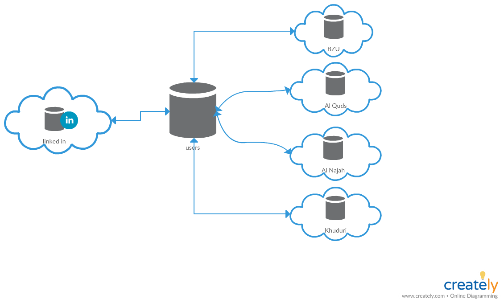
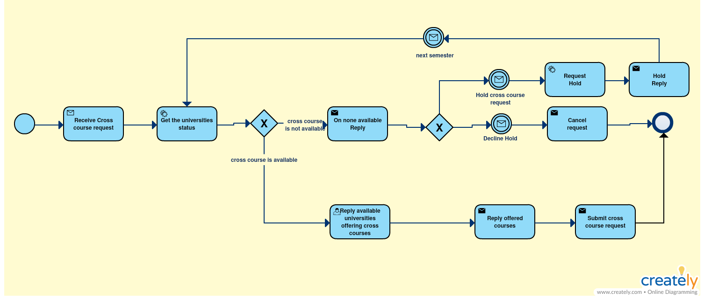
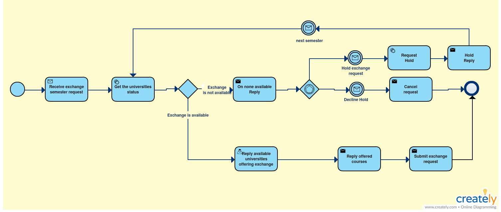

# Team5

## Palestinian universities student exchange and cross courses

This service provides to a whole new system for palestinian students, to locally exchange, and take cross courses from local universities in Palestine.

This service needs is still in progress, but it may need a lot of previliges, in order to run successfully, we need access to universities' databases of students, their marks, and their finished courses. The ministry of high studies acceptance is a high priority for this to operate.

Accounts for this service can be connected with LinkedIn, this would help the university when checking for the student applying for its cross-course or exchange, to see his/her background in job, school, acheivments, etc...

---

### Service Oriented Architecture Diagram

---

### Business Process Model Notation

#### Cross Course

#### Exchange Student

---

## Contributors
 - Abed Al Rahman Murrar - 1140155
 - Haron Taha - 114****

 ---
If you want to contribute to this project/service please <a href="mailto:1140155@student.birzeit.edu">email us</a>.