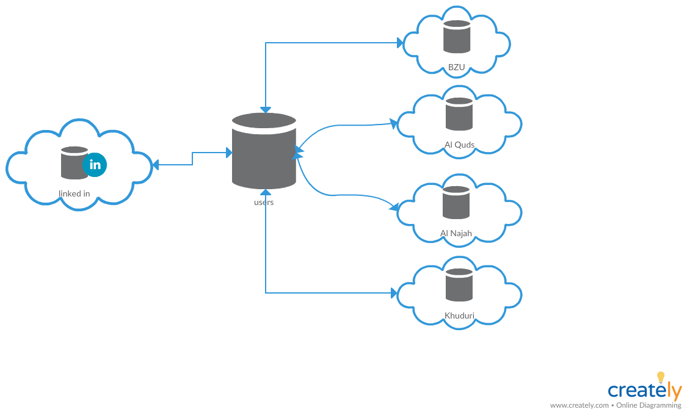
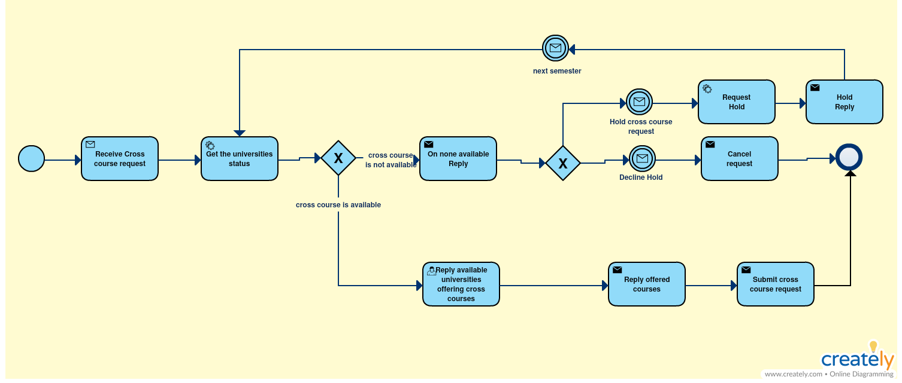
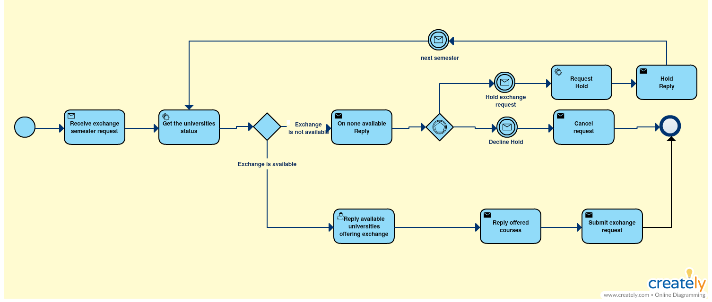

# Team5

## Resources

<a href="https://spring.io/guides/gs/accessing-data-mysql/">Accessing data with MySQL</a>

## Palestinian universities student exchange and cross courses

This service provides to a whole new system for palestinian students, to locally exchange, and take cross courses from local universities in Palestine.   
 This service needs is still in progress, but it may need a lot of previliges, in order to run successfully, we need access to universities' databases of students, their marks, and their finished courses. The ministry of high studies acceptance is a high priority for this to operate.

Accounts for this service can be connected with LinkedIn, this would help the university when checking for the student applying for its cross-course or exchange, to see his/her background in job, school, acheivments, etc...

---

### Service Oriented Architecture Diagram

 abut SOA  Our services are shared by all files between the data base and our universities
 So that if the person registered in one party only can access this file that the person in the registration of existing 
 universities by means of which you have to link these universities

---

### Business Process Model Notation

#### Cross Course

#### Exchange Student

the composite service talks twith the atomic services by LinkedIn and database and the service we built it,
We used the tracking process where we tracked the file from the registration by the person on arrival at all universities 
or the course registration and arrival to all concerned parties and all universities,
As for the parallel, it can be used in the process of mobile navigation to and from universities, 
it is transferred to all at the same time
We also used the conditions at each stage of the drawing in and during 
the programming so that the conditions affect the course of the process
All of this is shown in the diagram.

---
## Implementation Details
We impelemented our services using the RESTful service development paradigm. Which is based on the HTTP protocol which is an RPC-based synchronous communication protocol.

## Composite Service Algorithm According to BPMN 2.0
'''java
@RestController
public class ExchangesController {

	@GetMapping("/exchanges")
	public ArrayList<Exchange> getAllExchanges(@RequestParam(value = "university", required = false) String university,
			@RequestParam(value = "year", required = false) String year) {
		ArrayList<Exchange> exchanges = new ArrayList<Exchange>();
		return exchanges;
	}

	@GetMapping("/exchanges/{id}")
	public Exchange getUserById(@PathVariable Integer id) {
		if (id != null)
			return new Exchange();
		else
			return null;
	}

	@PostMapping("/exchanges")
	public void addNewExchange(@RequestBody Exchange exchange) {
		//
	}

	@PutMapping("/exchanges/{id}")
	public void editExchange(@RequestBody Exchange newExchange, @PathVariable int id) {
		//
	}

	@DeleteMapping("exchanges/{id}")
	public void deleteExchange(@PathVariable int id) {
		//
	}
'''
</img>

</img>
</img>
</img>
</img>
</img>
</img>
</img>
</img>
</img>

## Applied Technologies
 we use development environment visual studio code , eclipse, advanced rest client, google chrome
 we use  java programming languages
 we use frameworks and libraries wagger 2.0, spring boot ,postman
 we use deployment platforms (PaaS)
 we use application server Tomcat   .  
 
## Contributors
